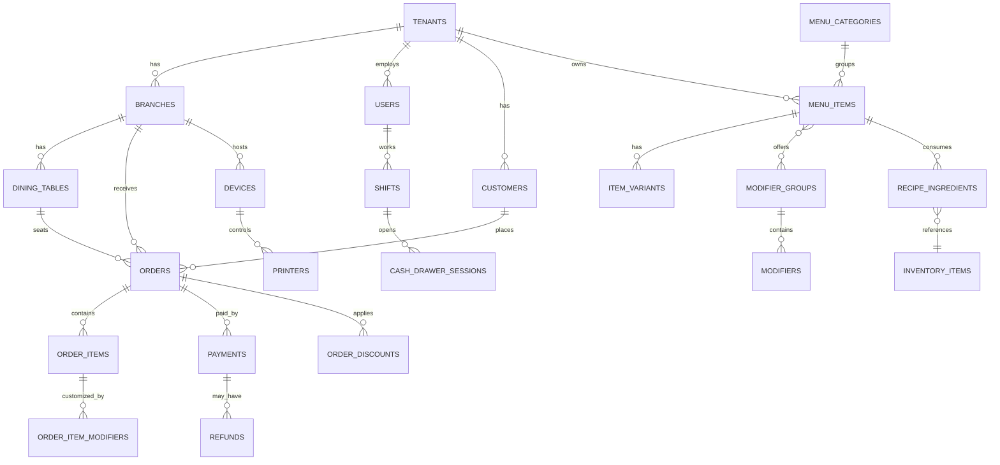

# Entity-Relationship Overview

Full DDL lives in [`schema.sql`](./schema.sql) — 35 tables. This is the core-entities view (the rest — inventory, shifts, loyalty, audit — hang off `tenants`/`branches`/`orders` the same way).

## Design decisions worth knowing about

**Multi-tenant from day one.** Every operational table carries `tenant_id` (and usually `branch_id`). This means one deployment can host many restaurant brands, or you can treat a single restaurant as `tenant_id = 1` and ignore the multi-tenancy — it costs nothing to have it and a lot to retrofit later. Enforce it in two layers: an Eloquent global scope in the app, and optionally Postgres row-level security as a second line of defense (commented at the bottom of `schema.sql`).

**Money is never floated.** All prices/totals are `DECIMAL`, never `FLOAT`. `order_items.unit_price` freezes the price at time of sale — changing a menu price later must never rewrite historical order totals.

**Inventory deduction is recipe-driven, not item-driven.** `recipe_ingredients` maps a sellable `menu_item`/`item_variant` to the raw `inventory_items` it consumes and by how much. When an order is completed, a background job walks the recipe and writes `stock_movements` rows — that table is the single source of truth for "why does this ingredient count look like this," which you'll need the first time a manager disputes a stock count.

**Analytics is two-tier.** `analytics_events` is an unopinionated append-only event log (JSONB payload) — cheap to write from anywhere (API, mobile, kiosk), flexible to query later even for questions you haven't thought of yet. `daily_sales_summary` is a rebuilt-nightly rollup table that the dashboard actually queries, so a "sales this month" chart doesn't have to scan and sum thousands of raw orders on every page load.

**Offline sync has a seam built in.** `orders.idempotency_key` + `orders.synced_at` exist specifically for the desktop POS and mobile waiter app: they can create orders locally while offline (SQLite), stamp a client-generated idempotency key, and safely POST to the cloud API once connectivity returns without risking duplicate orders if the sync retries.

**PCI scope is deliberately narrow.** The `payments` table stores `provider_reference`, `card_brand`, `card_last4` — display/reconciliation data only. No PAN, CVV, or track data ever touches this database; that's the payment gateway's/terminal SDK's job (see `docs/SECURITY.md`).

**Everything financially destructive is logged, not deleted.** Discounts, refunds, voided order items, and stock adjustments are all additive rows (`refunds`, `stock_movements`, `audit_logs`) rather than mutations — you can always reconstruct "what actually happened," which matters both for trust with restaurant owners and for any future dispute or audit.
